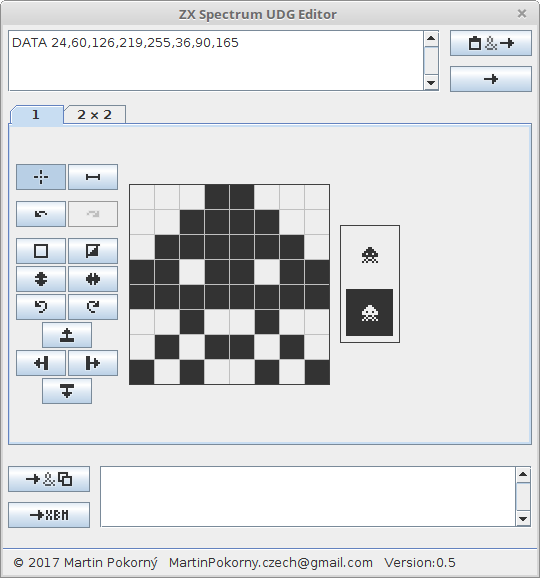

zxs_udg_editor
==============

Simple UDG (User Defined Graphics) character editor for Sinclair ZX Spectrum BASIC.

For more information about ZX Spectrum and UDG see: 
[ZX Spectrum](https://en.wikipedia.org/wiki/ZX_Spectrum), [ZX Spectrum character set](https://en.wikipedia.org/wiki/ZX_Spectrum_character_set) on Wikipedia.

### Requirements
Java 7 or newer.

### How to Built
1. install '''Java SE Development Kit (JDK)''' and install '''Netbeans IDE'''
2. open project in Netbeans.
4. select "Clean and build project" in menu "Run". Result should be in folders '''dist''', '''dist_zip'''.

### Screenshot

