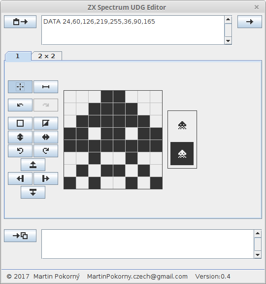

zxs_udg_editor
==============

Simple UDG (User Defined Graphics) character editor for BASIC of historical computer ZX Spectrum.

For more information about ZX Spectrum and UDG see: 
[ZX Spectrum](https://en.wikipedia.org/wiki/ZX_Spectrum), [ZX Spectrum character set](https://en.wikipedia.org/wiki/ZX_Spectrum_character_set)

Requirements:
- Java runtime environment

Screenshot:

